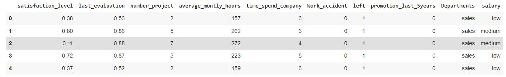
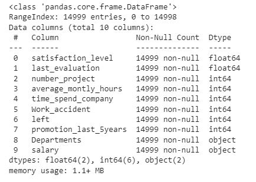
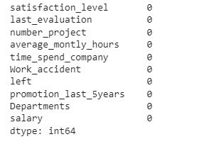
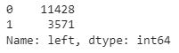
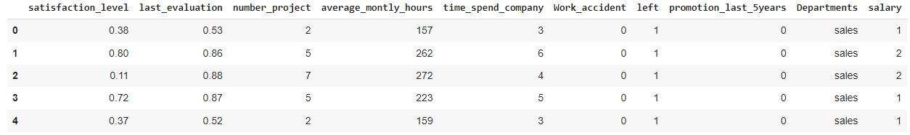
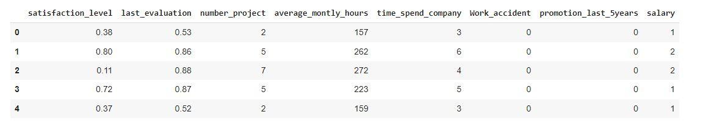
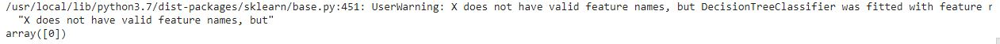

# Implementation-of-Decision-Tree-Classifier-Model-for-Predicting-Employee-Churn

## AIM:
To write a program to implement the Decision Tree Classifier Model for Predicting Employee Churn.

## Equipments Required:
1. Hardware – PCs
2. Anaconda – Python 3.7 Installation / Moodle-Code Runner

## Algorithm
1. Import pandas library to read csv or excel file.
2. Import LabelEncoder using sklearn.preprocessing library.
3. Transform the data's using LabelEncoder.
4. Import decision tree classifier from sklearn.tree library to predict the values.
5. Find accuracy.
6. Predict the values.
7. End of the program.

## Program:
```python

import pandas as pd
d=pd.read_csv("Employee (1).csv")
d.head()
d.info()
d.isnull().sum()
d["left"].value_counts() 

from sklearn.preprocessing import LabelEncoder
l=LabelEncoder()

x=d[["satisfaction_level","last_evaluation","number_project","average_montly_hours","time_spend_company","Work_accident","promotion_last_5years","salary"]]
x.head()
y=d["left"]

from sklearn.model_selection import train_test_split
x_train,x_test,y_train,y_test=train_test_split(x,y,test_size=0.2,random_state=100)

from sklearn.tree import DecisionTreeClassifier
dt=DecisionTreeClassifier(criterion="entropy")
dt.fit(x_train,y_train)
y_pred=dt.predict(x_test)

from sklearn import metrics
acc=metrics.accuracy_score(y_test,y_pred)
acc

dt.predict([[.5,.8,9,260,6,0,1,2]])
*/
```

## Output:
### Head:

### Info:

### Isnull:


### Head using labelencoder:




### Accuracy with entropy:

### Prediction without entropy:


## Result:
Thus the program to implement the  Decision Tree Classifier Model for Predicting Employee Churn is written and verified using python programming.